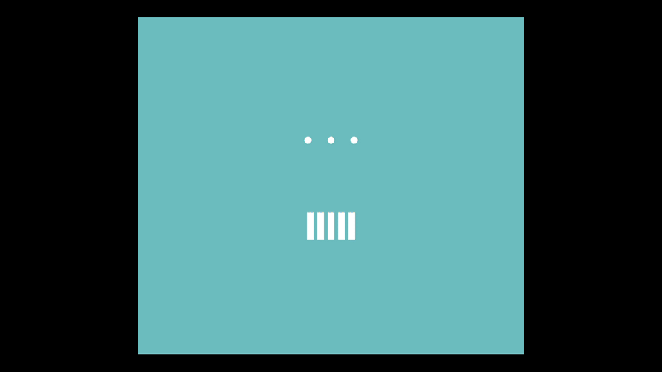

<h1 align="center"> Practice - html & css </h1>

> ⬆︎ 이미지 구현 하기
 

## 핵심 코드
*  'animation-delay'
*  'transform'
*  'border-radius'

## 사용 방법
- animation-delay 속성 - animation의 시작을 지연시키는 속성을 활용해 각 막대의 시작 시간차를 두기.

- transform 속성 - 적용된 요소에 다양한 위치 변화를 적용.

- border-radius 속성 - 동그라미 만들기에 활용.
 

---

_This README makd by  [hojncode](https://github.com/hojncode)_
